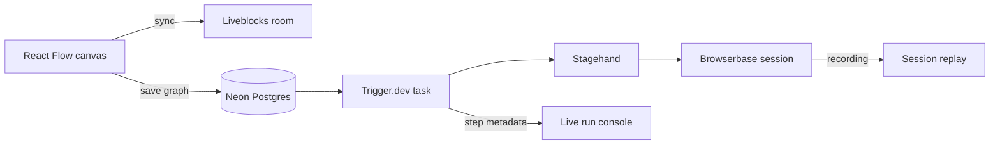

<div align="center">

<br />

<h1>Waypoint</h1>

<p><strong>Design in real time. Execute in cloud browsers. Replay every run.</strong></p>

<p>A collaborative visual workflow builder for browser automation, powered by Stagehand, Browserbase, Trigger.dev, and Liveblocks.</p>

<p>
  <a href="#features">Features</a>&nbsp;&nbsp;&bull;&nbsp;&nbsp;
  <a href="#workflow-nodes">Nodes</a>&nbsp;&nbsp;&bull;&nbsp;&nbsp;
  <a href="#how-it-works">Architecture</a>&nbsp;&nbsp;&bull;&nbsp;&nbsp;
  <a href="#getting-started">Quick start</a>&nbsp;&nbsp;&bull;&nbsp;&nbsp;
  <a href="#project-structure">Structure</a>&nbsp;&nbsp;&bull;&nbsp;&nbsp;
  <a href="#security-notes">Security</a>
</p>

<br />

<p>
  <a href="https://docs.stagehand.dev"></a>&nbsp;
  <a href="https://browserbase.com"></a>&nbsp;
  <a href="https://trigger.dev"></a>&nbsp;
  <a href="https://liveblocks.io"></a>&nbsp;
  <a href="https://neon.tech"></a>&nbsp;
  <a href="https://clerk.com"></a>&nbsp;
  <a href="https://resend.com"></a>
</p>

</div>

<br />


<p align="center"><sub>Build together on a live canvas, then follow every node from execution to output.</sub></p>

<br />

> Compose browser automations as connected nodes, watch every step execute live, and inspect the complete browser session once the run finishes.

---

## Features

<table>
  <tr>
    <td width="50%" valign="top">
      <strong>Visual workflow canvas</strong><br />
      Compose browser automations with draggable, connectable React Flow nodes.
    </td>
    <td width="50%" valign="top">
      <strong>Real-time collaboration</strong><br />
      Edit together with Liveblocks-powered shared graph state, cursors, and presence.
    </td>
  </tr>
  <tr>
    <td width="50%" valign="top">
      <strong>AI-driven browser actions</strong><br />
      Navigate, act, observe, extract, and run autonomous tasks with Stagehand.
    </td>
    <td width="50%" valign="top">
      <strong>Connected data</strong><br />
      Pass a step's output downstream with <code>{{ nodeId.path }}</code> template expressions.
    </td>
  </tr>
  <tr>
    <td width="50%" valign="top">
      <strong>Durable execution</strong><br />
      Runs execute as retryable Trigger.dev tasks with live step status streamed back.
    </td>
    <td width="50%" valign="top">
      <strong>Run observability</strong><br />
      Inspect step timing, outputs, failures, and the full Browserbase session replay.
    </td>
  </tr>
  <tr>
    <td width="50%" valign="top">
      <strong>Organization workspaces</strong><br />
      Workflows and collaborative canvases are scoped to a Clerk organization.
    </td>
    <td width="50%" valign="top">
      <strong>Plan-gated features</strong><br />
      Agent-node runs and session replay require an organization on the Pro plan.
    </td>
  </tr>
</table>

<br />

## Workflow Nodes

| Node | Description | Outputs |
|------|-------------|---------|
| Start | Marks a workflow's entry point | — |
| Open URL | Navigates the shared browser session to a URL | `url`, `title` |
| Act | Performs one atomic browser action from a natural-language instruction | `success`, `message`, `url` |
| Extract | Extracts structured data from the page per a natural-language instruction | `result` |
| Observe | Finds candidate elements/actions matching an instruction | `matches` |
| Agent | Runs an autonomous, multi-step task toward a goal | `success`, `message`, `completed` |
| Send Email | Sends an email through Resend | `id` |

New node types are added in three places under `features/workflows/nodes`: the executor implementation, its registration in `node-executors.ts` (a `satisfies` contract makes a missing executor a compile-time error), and its manifest entry in `node-registry.ts`. The canvas and the run task are registry-driven, so nothing else needs to change to add a node.

---

## How It Works



1. **Design** — Liveblocks synchronizes nodes, edges, cursors, and presence on the React Flow canvas.
2. **Save** — running a workflow saves its current graph snapshot as JSONB on the `workflows` table, scoped to the organization.
3. **Schedule** — the `run-workflow` Trigger.dev task loads the graph, topologically sorts connected nodes (`toposort`), and skips orphans, failing fast on cycles.
4. **Automate** — a single Browserbase session is opened lazily on the first browser-touching step and reused for the rest of the run, so one recording spans the whole workflow.
5. **Connect** — each step's inputs are interpolated against prior steps' outputs before it executes.
6. **Observe** — step status, output, and errors are written to Trigger.dev run metadata and streamed to the client in real time.
7. **Replay** — on completion, the Browserbase session ID is returned so the UI can offer the full session recording.

---

## Getting Started

### Prerequisites

- Node.js 22.18+ (Stagehand v4 requires it; Trigger.dev tasks run on the `node-24` runtime for the same reason)
- A [Clerk](https://clerk.com) application with Organizations and a Pro plan configured
- A Postgres database — [Neon](https://neon.tech) recommended
- A [Trigger.dev](https://trigger.dev) project
- A [Liveblocks](https://liveblocks.io) project
- A [Browserbase](https://browserbase.com) account and API key
- A [Resend](https://resend.com) API key

### 1. Clone and install

```bash
git clone <this-repo>
cd waypoint
npm install
```

### 2. Configure environment

Create `.env.local`:

```bash
NEXT_PUBLIC_CLERK_SIGN_IN_URL=
NEXT_PUBLIC_CLERK_SIGN_UP_URL=
NEXT_PUBLIC_CLERK_SIGN_IN_FALLBACK_REDIRECT_URL=
NEXT_PUBLIC_CLERK_SIGN_UP_FALLBACK_REDIRECT_URL=

NEXT_PUBLIC_CLERK_PUBLISHABLE_KEY=
CLERK_SECRET_KEY=

NEON_BRANCH=
DATABASE_URL=
DATABASE_URL_UNPOOLED=

TRIGGER_SECRET_KEY=

NEXT_PUBLIC_LIVEBLOCKS_PUBLIC_KEY=
LIVEBLOCKS_SECRET_KEY=

BROWSERBASE_API_KEY=
RESEND_API_KEY=
```

### 3. Configure Clerk

Enable Organizations — the dashboard requires an active organization, and every workflow is scoped to it. To unlock plan-gated features, configure Clerk Billing with an organization plan whose slug is exactly `pro`; Agent-node runs and session replay check this plan server-side.

### 4. Set up the database

```bash
npm run db:generate
npm run db:migrate
```

For local prototyping you can push the schema directly instead:

```bash
npm run db:push
```

### 5. Run the app and the worker

In separate terminals:

```bash
npm run dev
npx trigger.dev@latest dev
```

The worker discovers tasks under `features/` per `trigger.config.ts`. The Stagehand model runs through Browserbase's model gateway, so no separate model-provider API key is required.

Open [http://localhost:3000](http://localhost:3000), sign in, select or create an organization, and build your first workflow.

### Scripts

| Command | Description |
|---------|-------------|
| `npm run dev` | Start the Next.js development server |
| `npm run build` | Create a production build |
| `npm start` | Start the production server |
| `npm run lint` | Run ESLint |
| `npm run format` | Format TypeScript and TSX files with Prettier |
| `npm run typecheck` | Run TypeScript without emitting files |
| `npm run db:generate` | Generate Drizzle migrations |
| `npm run db:migrate` | Apply Drizzle migrations |
| `npm run db:push` | Push the Drizzle schema directly to the database |
| `npm run db:studio` | Open Drizzle Studio |

---

## Project Structure

```text
app/
├── (auth)/                     # Clerk sign-in, sign-up, and organization selection
├── (dashboard)/                # Workflow dashboard, editor, and billing page
└── api/
    ├── liveblocks/              # Liveblocks authentication and user resolution
    └── replays/                 # Browserbase recording proxy
components/
└── ui/                          # Shared shadcn/ui primitives
features/
└── workflows/
    ├── components/               # Canvas, panels, node UI, session replay player
    ├── hooks/                    # Plan-gating and graph connection hooks
    ├── lib/                      # Slug generation, output interpolation, graph validation
    ├── nodes/                    # Node registry and executor implementations
    ├── tasks/run-workflow.ts     # The Trigger.dev task that executes a saved graph
    ├── actions.ts                # Server actions for workflow mutations and runs
    └── data.ts                   # Organization-scoped workflow queries
lib/
├── db/                          # Drizzle schema, Neon client, and migrations
├── liveblocks.ts                # Liveblocks server client
└── resend.ts                    # Resend client
drizzle/                         # Generated SQL migrations
```

---

## Stack

| Technology | Purpose |
|------------|---------|
| Next.js 16 and React 19 | Application framework and interface |
| React Flow | Visual workflow canvas |
| Liveblocks | Collaborative graph state, cursors, and presence |
| Trigger.dev | Durable workflow execution, retries, and live run metadata |
| Stagehand | AI-powered browser actions, extraction, observation, and agents |
| Browserbase | Managed browser sessions, model gateway, and session recordings |
| Clerk | Authentication, organizations, and plan-gated billing |
| Neon and Drizzle | Serverless Postgres and typed database access |
| Resend | Email node delivery |

---

## Security Notes

- API keys are read from `process.env` and passed explicitly — nothing is read implicitly by Stagehand or the Browserbase SDK.
- Session replay retrieval requires the Browserbase *secret* key, so it's proxied through a server route (`app/api/replays/[sessionId]`) rather than ever reaching the client.
- Routes are protected by Clerk middleware by default; only `/sign-in` and `/sign-up` are public.
- Plan checks (`has({ plan: "pro" })`) gate both the replay API route and Agent-node runs, enforced server-side rather than only hidden in the UI.
